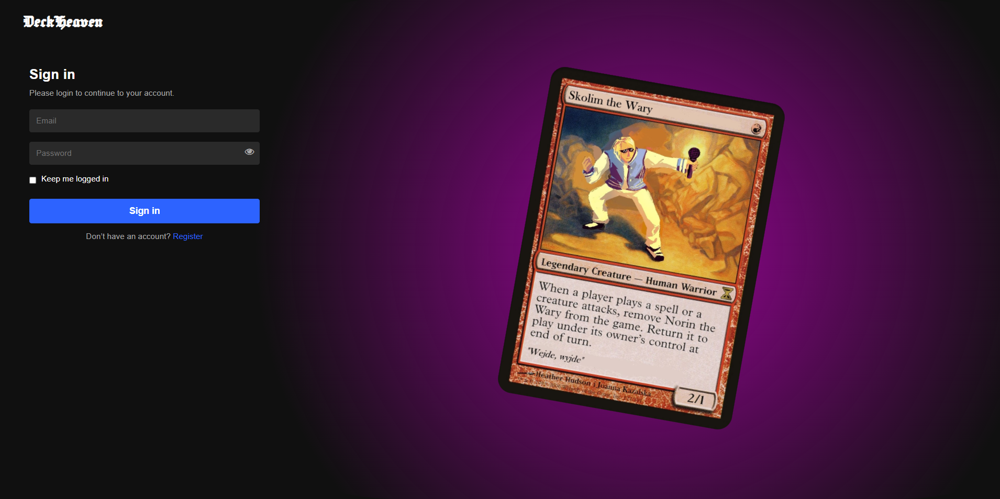
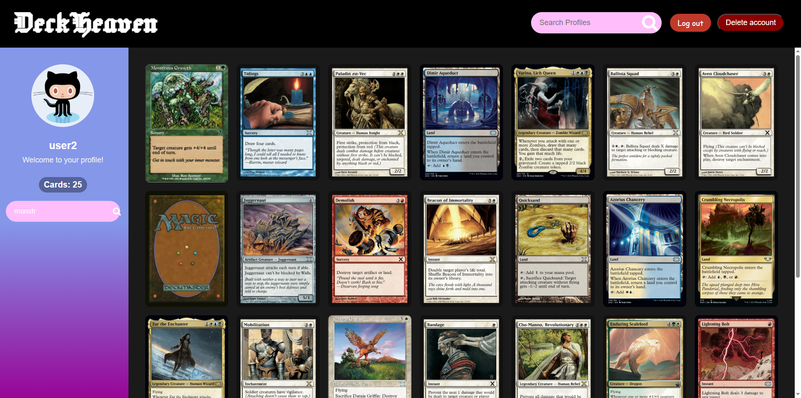
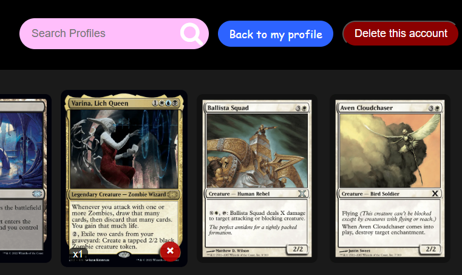
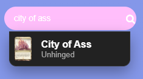
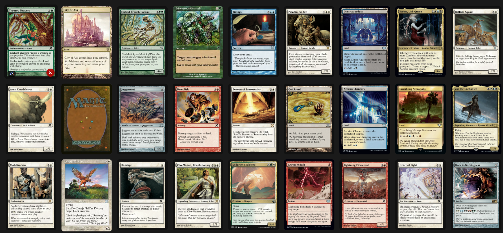
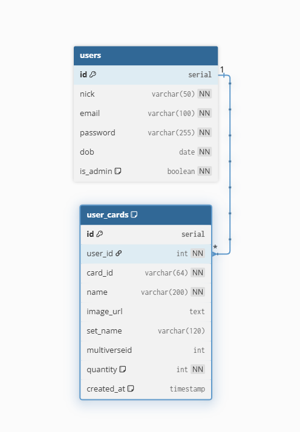

# DeckHeaven

A lightweight PHP + PostgreSQL web app for building and showcasing Magic: The Gathering card collections. Includes user accounts, profiles, searchable collections, and an admin mode for moderation.

<!-- Badges -->
<p align="left">
  <!-- Replace the links below with your CI/CD, coverage, and license badges -->
  <a href="#"></a>
  <a href="#"></a>
</p>

## Table of Contents
- [Screenshots / Demo](#screenshots--demo)
- [Features](#features)
- [Tech Stack](#tech-stack)
- [Project Structure](#project-structure)
- [Installation / Setup](#installation--setup)
- [Database Schema](#database-schema)
- [Contributing](#contributing)
- [TODO](#todo)
- [Authors](#authors)
- [License](#license)

## Screenshots / Demo

- Login page: 


- Registration page: 


- User dashboard/profile: 


- Admin panel: 


- Adding a card: 


- Full collection view: 


- Diagram ERD: 



## Features
- [x] User registration and login (hashed passwords)
- [x] View own and public profiles
- [x] Search Magic: The Gathering cards and add to collection
- [x] Quantity tracking and quick remove/decrement
- [x] Admin role: manage any user’s cards and delete accounts
- [x] Dockerized stack (Nginx, PHP-FPM, PostgreSQL, pgAdmin)
- [x] Unified profile view with dynamic public/private/admin controls

## Tech Stack
- Backend: PHP 8.3 (FPM), PDO PostgreSQL
- Frontend: Vanilla JS, HTML5, CSS (custom styles; Font Awesome icons)
- Database: PostgreSQL
- Web server: Nginx (Docker)
- Tools: Docker Compose, pgAdmin

## Project Structure
```
.
├─ docker-compose.yaml
├─ docker/
│  ├─ db/
│  │  └─ Dockerfile
│  ├─ nginx/
│  │  ├─ Dockerfile
│  │  └─ nginx.conf
│  └─ php/
│     └─ Dockerfile
├─ init.sql                  # DB schema and seed (admin)
├─ config/
│  └─ db.php                # PDO connection factory (PostgreSQL)
├─ src/                     # OOP layer (repositories, services)
│  ├─ autoload.php
│  ├─ Repository/
│  │  ├─ UserRepository.php
│  │  └─ UserCardRepository.php
│  └─ Service/
│     └─ AuthService.php
├─ api/                     # JSON endpoints (public/private)
│  ├─ add_card.php
│  ├─ get_cards.php
│  ├─ remove_card.php
│  ├─ search_cards.php
│  └─ search_profiles.php
├─ public/                  # Static assets and CSS
│  ├─ css/
│  │  ├─ globals.css
│  │  ├─ profile.css
│  │  └─ auth.css
│  └─ assets/
├─ profile.php              # Unified public/private profile page
├─ registration.php, login.php
├─ register_action.php, login_action.php, logout.php
├─ out_of_service.php
└─ wait-for-postgres.sh
```

## Installation / Setup
Prereqs: Docker Desktop installed and running.

1) Clone the repository
```bash
git clone https://github.com/<your-user>/<your-repo>.git
cd <your-repo>
```

2) Start the stack
```bash
# Windows PowerShell
# Starts Nginx (web), PHP-FPM (php), PostgreSQL (db), and pgAdmin
docker-compose up --build -d
```

3) Access services
- App: http://localhost:8080
- pgAdmin: http://localhost:5050 (email: admin@example.com, password: admin)
- Postgres: localhost:5433 (user: docker, password: docker, db: db)

4) First login (admin bootstrap)
- Admin email: `admin@gmail.com`
- Password: `123`
The app auto-creates/updates the admin user on first login.

5) Stopping the stack (optional)
```bash
docker-compose down
# Or to also remove volumes and reset DB
# docker-compose down -v
```

## Database Schema
The schema is initialized automatically from `init.sql`.

- Users, user_cards, and a unique constraint on `(user_id, card_id)`.
- Admin user seeded and enforced idempotently by email.

Add a diagram image here:

``

## Contributing
- Fork the repo and create a feature branch
- Keep PRs small and focused; include screenshots of UI changes
- Use prepared statements for DB access; avoid hardcoding secrets
- Discuss larger architectural changes in issues first


## License
idk idc ołpen sos
